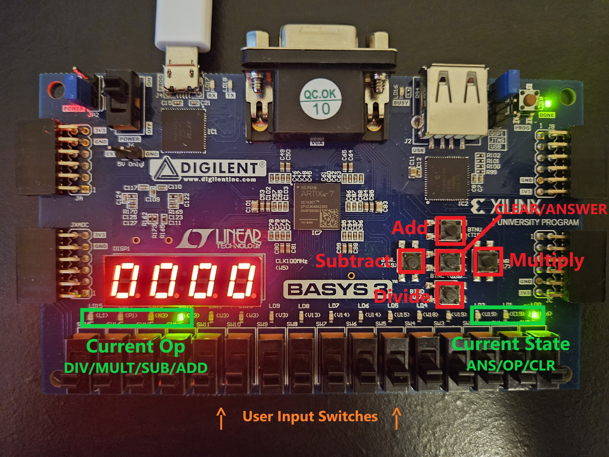

# Calculator-Digilent-Basys3
This is a simple calculator designed to run on the Digilent Basys3 FPGA. It supports operands 0-9999 inclusive and operations add, subtract, multiply, and divide. FPGA starts in CLEAR state. The user can set the first operand with the binary switches at the bottom. After setting the first operand, the user selects an operation with the buttons which sets the FPGA to the OP state where the user can set the second operand. User then presses the center button to calculate the answer which sets the FPGA in the ANSWER state where the answer will be displayed. The user can either press the center button again to reset the operands and set the FPGA back to the clear state or select an operation with the other button which results in the answer being reused as an operand.

## HDL Code
[Calculator-Digilent-Basys3.srcs/sources_1/new](https://github.com/cleverever/Calculator-Digilent-Basys3/tree/main/Calculator-Digilent-Basys3.srcs/sources_1/new)

## Calculator Demonstration
[https://drive.google.com/file/d/19n-1Wg0r_ckNw4BXWBYfvNYppTF3RHwn/view?usp=drive_link](https://drive.google.com/file/d/19n-1Wg0r_ckNw4BXWBYfvNYppTF3RHwn/view?usp=drive_link)
